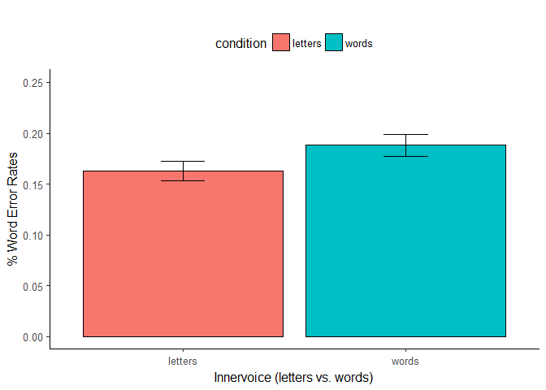
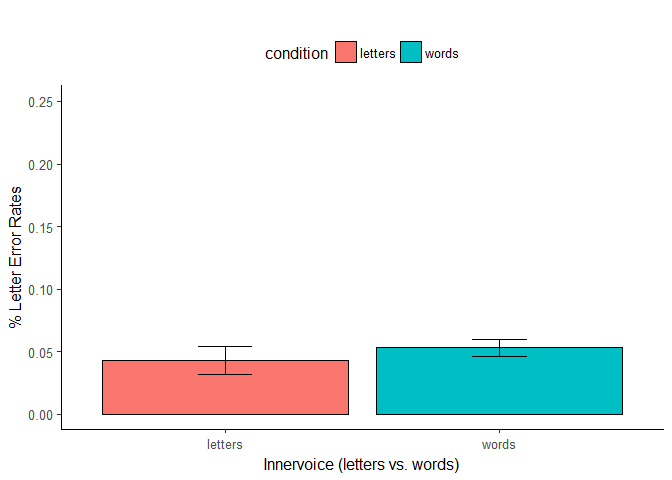
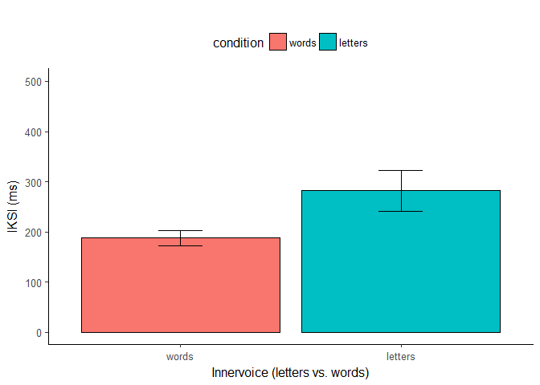
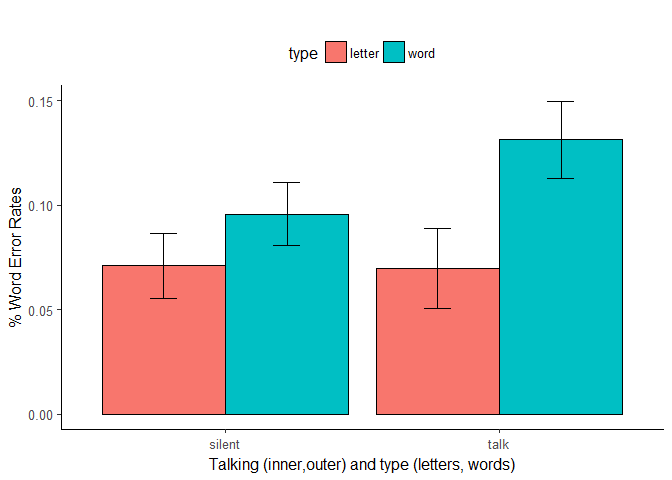
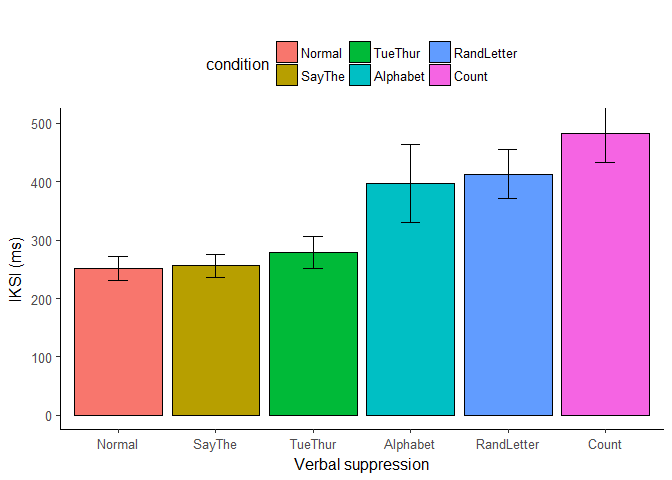

-   Instead of messing around with the livecode stuff, I re-processed
    all the data from the raw data files (see “to-data-frame.R” &
    “cleaning-functions.R”)
-   There are now clean and organized raw data files for each experiment
    (similar to the machine-learning data frames we used)
-   I used new functions to identify words and error words (by comparing
    each typed word to a list of words from the paragraph)
-   This leads to some small differences in the output. The main results
    however, are all the same (I’m more confident in this analysis than
    in my 2015 analysis)

``` r
load(file="E1A/data.Rda")
```

E1A: speaking letters vs. words (MTurk)
=======================================

-   Note: I ended up with 44 subs here (as opposed to 40). I
    re-processed from the raw data, so the answer probably lies there. I
    can’t see any issues with the 44 I have, but maybe warrants a closer
    look.

### Mean word and mean letter error rates

-   The only experiment that has letter-level accuracy

``` r
error.data<-data%>%
  filter(word_letterPos == 1,
         word_length != 0) %>%
  group_by(subject, condition) %>%
  summarize(
    N = n(),
    ER = 1-mean(word_ACC),
    sd = sd(1-word_ACC),
    se = sd / sqrt(N)
  )
  

aov.out <- aov_car(ER ~ condition + Error(subject/condition), data = error.data)

kable(nice(aov.out, es = "pes", observed = NULL,
    correction = c("none"), MSE = TRUE,
    sig.symbols = c(" +", " *", " **", " ***"))
,caption = "ANOVA")
```

    ## Warning: 'sig.symbols' is deprecated; use 'sig_symbols' instead

| Effect    | df    | MSE  | F       | pes | p.value |
|:----------|:------|:-----|:--------|:----|:--------|
| condition | 1, 43 | 0.00 | 5.78 \* | .12 | .02     |

``` r
error.summary <- error.data %>%
  group_by(condition) %>%
  summarize(
    N = n(),
    error = mean(ER),
    sd = sd(ER),
    se = sd / sqrt(N)
  )
  

limits <- aes(ymax = error + se, ymin = error - se)
ggplot(error.summary,aes(x=condition, y=error,fill=condition))+
  geom_bar(stat="identity", position=position_dodge(width=0.9),color="black") + 
  geom_errorbar(limits, width = .2, position=position_dodge(width=0.9))+
  coord_cartesian(ylim = c(0.1, .25))+
  theme_classic(base_size=12)+
  labs(title="")+
  ylab("% Word Error Rates")+
  xlab("Inner voice")+
  theme(legend.position="top",legend.direction="horizontal")
```



``` r
data$ACC<-as.numeric(as.character(data$ACC))

error.data<-data%>%
  filter(word_letterPos == 1,
         word_length != 0) %>%
  group_by(subject, condition) %>%
  summarize(
    N = n(),
    ER = 1-mean(ACC),
    sd = sd(1-ACC),
    se = sd / sqrt(N)
  )
  

aov.out <- aov_car(ER ~ condition + Error(subject/condition), data = error.data)

kable(nice(aov.out, es = "pes", observed = NULL,
    correction = c("none"), MSE = TRUE,
    sig.symbols = c(" +", " *", " **", " ***"))
,caption = "ANOVA")
```

    ## Warning: 'sig.symbols' is deprecated; use 'sig_symbols' instead

| Effect    | df    | MSE  | F    | pes  | p.value |
|:----------|:------|:-----|:-----|:-----|:--------|
| condition | 1, 43 | 0.00 | 0.16 | .004 | .69     |

``` r
error.summary <- error.data %>%
  group_by(condition) %>%
  summarize(
    N = n(),
    error = mean(ER),
    sd = sd(ER),
    se = sd / sqrt(N)
  )
  

limits <- aes(ymax = error + se, ymin = error - se)
ggplot(error.summary,aes(x=condition, y=error,fill=condition))+
  geom_bar(stat="identity", position=position_dodge(width=0.9),color="black") + 
  geom_errorbar(limits, width = .2, position=position_dodge(width=0.9))+
  #coord_cartesian(ylim = c(0.1, .25))+
  theme_classic(base_size=12)+
  labs(title="")+
  ylab("% Letter Error Rates")+
  xlab("Inner voice")+
  theme(legend.position="top",legend.direction="horizontal")
```



### IKSI analysis

``` r
iksi.data<-data%>%
  filter(keyNum != 1) %>%
  group_by(subject,condition) %>%
  summarize(meanIKSI = mean(IKSI))


aov.out <- aov_car(meanIKSI ~ condition + Error(subject/condition), data = iksi.data)

kable(nice(aov.out, es = "pes", observed = NULL,
    correction = c("none"), MSE = TRUE,
    sig.symbols = c(" +", " *", " **", " ***"))
,caption = "ANOVA")
```

    ## Warning: 'sig.symbols' is deprecated; use 'sig_symbols' instead

| Effect    | df    | MSE      | F       | pes | p.value |
|:----------|:------|:---------|:--------|:----|:--------|
| condition | 1, 43 | 32269.73 | 6.07 \* | .12 | .02     |

``` r
iksi.summary<-iksi.data%>%
  group_by(condition)%>%
  summarize(
    N = n(),
    IKSI = mean(meanIKSI),
    sd = sd(meanIKSI),
    se = sd / sqrt(N)
  )

iksi.summary = iksi.summary %>% mutate(condition = reorder(condition, IKSI, mean))

limits <- aes(ymax = IKSI + se, ymin = IKSI - se)
ggplot(iksi.summary,aes(x=condition, y=IKSI,fill=condition))+
  geom_bar(stat="identity", position=position_dodge(width=0.9),color="black") + 
  geom_errorbar(limits, width = .2, position=position_dodge(width=0.9))+
  coord_cartesian(ylim = c(0, 500))+
  theme_classic(base_size=12)+
  labs(title="")+
  ylab("IKSI (ms)")+
  xlab("Articulatory suppression task")+
  theme(legend.position="top",legend.direction="horizontal")
```



E1B: talking (inner, outer) X type (letters, words)
===================================================

``` r
load(file="E1B/data.Rda")
```

### Mean word error rates

``` r
# 1 sub removed with high error rate (ASDF sub)

error.data<-data%>%
  filter(word_letterPos == 1,
         word_length != 0,
         condition != "Normal",
         subject != "p4c4") %>%
  group_by(subject, talk,type) %>%
  summarize(
    N = n(),
    ER = 1-mean(word_ACC),
    sd = sd(1-word_ACC),
    se = sd / sqrt(N)
  )
  

aov.out <- aov_car(ER ~ talk*type + Error(subject/talk*type), data = error.data)

kable(nice(aov.out, es = "pes", observed = NULL,
    correction = c("none"), MSE = TRUE,
    sig.symbols = c(" +", " *", " **", " ***"))
,caption = "ANOVA")
```

    ## Warning: 'sig.symbols' is deprecated; use 'sig_symbols' instead

| Effect    | df    | MSE  | F          | pes | p.value |
|:----------|:------|:-----|:-----------|:----|:--------|
| talk      | 1, 14 | 0.00 | 3.10       | .18 | .10     |
| type      | 1, 14 | 0.00 | 13.88 \*\* | .50 | .002    |
| talk:type | 1, 14 | 0.00 | 1.69       | .11 | .22     |

``` r
error.summary <- error.data %>%
  group_by(talk,type) %>%
  summarize(
    N = n(),
    error = mean(ER),
    sd = sd(ER),
    se = sd / sqrt(N)
  )
  

limits <- aes(ymax = error + se, ymin = error - se)
ggplot(error.summary,aes(x=talk, y=error,fill=type))+
  geom_bar(stat="identity", position=position_dodge(width=0.9),color="black") + 
  geom_errorbar(limits, width = .2, position=position_dodge(width=0.9))+
  #coord_cartesian(ylim = c(0.1, .25))+
  theme_classic(base_size=12)+
  labs(title="")+
  ylab("% Word Error Rates")+
  xlab("talking by type")+
  theme(legend.position="top",legend.direction="horizontal")
```



### Mean IKSI

``` r
iksi.data<-data%>%
  filter(keyNum != 1,
         subject != "p4c4",
         condition != "Normal") %>%
  group_by(subject,talk,type) %>%
  summarize(meanIKSI = mean(IKSI))


aov.out <- aov_car(meanIKSI ~ talk*type + Error(subject/talk*type), data = iksi.data)

kable(nice(aov.out, es = "pes", observed = NULL,
    correction = c("none"), MSE = TRUE,
    sig.symbols = c(" +", " *", " **", " ***"))
,caption = "ANOVA")
```

    ## Warning: 'sig.symbols' is deprecated; use 'sig_symbols' instead

| Effect    | df    | MSE     | F            | pes | p.value   |
|:----------|:------|:--------|:-------------|:----|:----------|
| talk      | 1, 14 | 1277.82 | 4.50 +       | .24 | .05       |
| type      | 1, 14 | 8464.46 | 29.24 \*\*\* | .68 | &lt;.0001 |
| talk:type | 1, 14 | 2497.33 | 3.47 +       | .20 | .08       |

``` r
iksi.summary<-iksi.data%>%
  group_by(talk,type)%>%
  summarize(
    N = n(),
    IKSI = mean(meanIKSI),
    sd = sd(meanIKSI),
    se = sd / sqrt(N)
  )


limits <- aes(ymax = IKSI + se, ymin = IKSI - se)
ggplot(iksi.summary,aes(x=talk, y=IKSI,fill=type))+
  geom_bar(stat="identity", position=position_dodge(width=0.9),color="black") + 
  geom_errorbar(limits, width = .2, position=position_dodge(width=0.9))+
  coord_cartesian(ylim = c(0, 500))+
  theme_classic(base_size=12)+
  labs(title="")+
  ylab("IKSI (ms)")+
  xlab("Talking and typing")+
  theme(legend.position="top",legend.direction="horizontal")
```


E2: Verbal Suppression
======================

``` r
load(file="E2/data.Rda")
```

### Mean word error rates

``` r
error.data<-data%>%
  filter(word_letterPos == 1,
         word_length != 0) %>%
  group_by(subject, condition) %>%
  summarize(
    N = n(),
    ER = 1-mean(word_ACC),
    sd = sd(1-word_ACC),
    se = sd / sqrt(N)
  )
  

aov.out <- aov_car(ER ~ condition + Error(subject/condition), data = error.data)

kable(nice(aov.out, es = "pes", observed = NULL,
    correction = c("none"), MSE = TRUE,
    sig.symbols = c(" +", " *", " **", " ***"))
,caption = "ANOVA")
```

    ## Warning: 'sig.symbols' is deprecated; use 'sig_symbols' instead

| Effect    | df    | MSE  | F         | pes | p.value |
|:----------|:------|:-----|:----------|:----|:--------|
| condition | 5, 70 | 0.00 | 3.60 \*\* | .20 | .006    |

``` r
error.summary <- error.data %>%
  group_by(condition) %>%
  summarize(
    N = n(),
    error = mean(ER),
    sd = sd(ER),
    se = sd / sqrt(N)
  )

error.summary = error.summary %>% mutate(condition = reorder(condition, error, mean))


limits <- aes(ymax = error + se, ymin = error - se)
ggplot(error.summary,aes(x=condition, y=error,fill=condition))+
  geom_bar(stat="identity", position=position_dodge(width=0.9),color="black") + 
  geom_errorbar(limits, width = .2, position=position_dodge(width=0.9))+
  coord_cartesian(ylim = c(0.1, .25))+
  theme_classic(base_size=12)+
  labs(title="")+
  ylab("Error Rates")+
  xlab("Verbal suppression")+
  theme(legend.position="top",legend.direction="horizontal")
```


``` r
iksi.data<-data%>%
  filter(keyNum != 1) %>%
  group_by(subject,condition) %>%
  summarize(meanIKSI = mean(IKSI))


aov.out <- aov_car(meanIKSI ~ condition + Error(subject/condition), data = iksi.data)

kable(nice(aov.out, es = "pes", observed = NULL,
    correction = c("none"), MSE = TRUE,
    sig.symbols = c(" +", " *", " **", " ***"))
,caption = "ANOVA")
```

    ## Warning: 'sig.symbols' is deprecated; use 'sig_symbols' instead

| Effect    | df    | MSE     | F            | pes | p.value   |
|:----------|:------|:--------|:-------------|:----|:----------|
| condition | 5, 70 | 9960.52 | 14.26 \*\*\* | .50 | &lt;.0001 |

``` r
iksi.summary<-iksi.data%>%
  group_by(condition)%>%
  summarize(
    N = n(),
    IKSI = mean(meanIKSI),
    sd = sd(meanIKSI),
    se = sd / sqrt(N)
  )

iksi.summary = iksi.summary %>% mutate(condition = reorder(condition, IKSI, mean))

limits <- aes(ymax = IKSI + se, ymin = IKSI - se)
ggplot(iksi.summary,aes(x=condition, y=IKSI,fill=condition))+
  geom_bar(stat="identity", position=position_dodge(width=0.9),color="black") + 
  geom_errorbar(limits, width = .2, position=position_dodge(width=0.9))+
  coord_cartesian(ylim = c(0, 500))+
  theme_classic(base_size=12)+
  labs(title="")+
  ylab("IKSI (ms)")+
  xlab("Articulatory suppression task")+
  theme(legend.position="top",legend.direction="horizontal")
```



E3: Delayed auditory feedback
=============================

``` r
load(file="E3/data.Rda")
```

### Mean word error rates

``` r
error.data<-data%>%
  filter(word_letterPos == 1,
         word_length != 0) %>%
  group_by(subject, delay) %>%
  summarize(
    N = n(),
    ER = 1-mean(word_ACC),
    sd = sd(1-word_ACC),
    se = sd / sqrt(N)
  )
  

aov.out <- aov_car(ER ~ delay + Error(subject/delay), data = error.data)

kable(nice(aov.out, es = "pes", observed = NULL,
    correction = c("none"), MSE = TRUE,
    sig.symbols = c(" +", " *", " **", " ***"))
,caption = "ANOVA")
```

    ## Warning: 'sig.symbols' is deprecated; use 'sig_symbols' instead

| Effect | df    | MSE  | F    | pes | p.value |
|:-------|:------|:-----|:-----|:----|:--------|
| delay  | 2, 38 | 0.00 | 1.80 | .09 | .18     |

``` r
error.summary <- error.data %>%
  group_by(delay) %>%
  summarize(
    N = n(),
    error = mean(ER),
    sd = sd(ER),
    se = sd / sqrt(N)
  )
  

limits <- aes(ymax = error + se, ymin = error - se)
ggplot(error.summary,aes(x=delay, y=error,fill=delay))+
  geom_bar(stat="identity", position=position_dodge(width=0.9),color="black") + 
  geom_errorbar(limits, width = .2, position=position_dodge(width=0.9))+
  coord_cartesian(ylim = c(0.1, .25))+
  theme_classic(base_size=12)+
  labs(title="")+
  ylab("Error Rates")+
  xlab("Delayed Feedback")+
  theme(legend.position="top",legend.direction="horizontal")
```


### Mean IKSI

``` r
iksi.data<-data%>%
  filter(keyNum != 1) %>%
  group_by(subject,delay) %>%
  summarize(meanIKSI = mean(IKSI))


aov.out <- aov_car(meanIKSI ~ delay + Error(subject/delay), data = iksi.data)

kable(nice(aov.out, es = "pes", observed = NULL,
    correction = c("none"), MSE = TRUE,
    sig.symbols = c(" +", " *", " **", " ***"))
,caption = "ANOVA")
```

    ## Warning: 'sig.symbols' is deprecated; use 'sig_symbols' instead

| Effect | df    | MSE    | F       | pes | p.value |
|:-------|:------|:-------|:--------|:----|:--------|
| delay  | 2, 38 | 145.33 | 5.02 \* | .21 | .01     |

``` r
iksi.summary<-iksi.data%>%
  group_by(delay)%>%
  summarize(
    N = n(),
    IKSI = mean(meanIKSI),
    sd = sd(meanIKSI),
    se = sd / sqrt(N)
  )
  

limits <- aes(ymax = IKSI + se, ymin = IKSI - se)
ggplot(iksi.summary,aes(x=delay, y=IKSI,fill=delay))+
  geom_bar(stat="identity", position=position_dodge(width=0.9),color="black") + 
  geom_errorbar(limits, width = .2, position=position_dodge(width=0.9))+
  coord_cartesian(ylim = c(200, 325))+
  theme_classic(base_size=12)+
  labs(title="")+
  ylab("IKSI (ms)")+
  xlab("Delayed Feedback")+
  theme(legend.position="top",legend.direction="horizontal")
```


